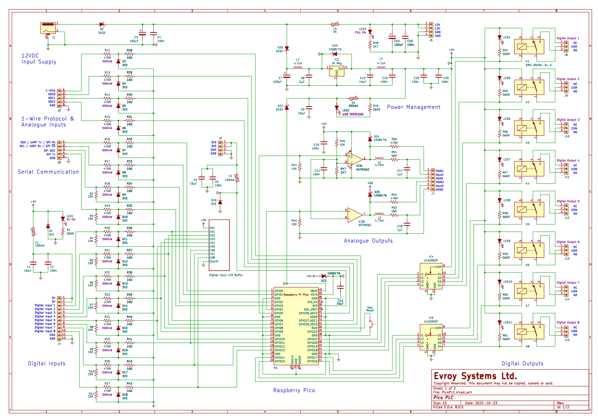
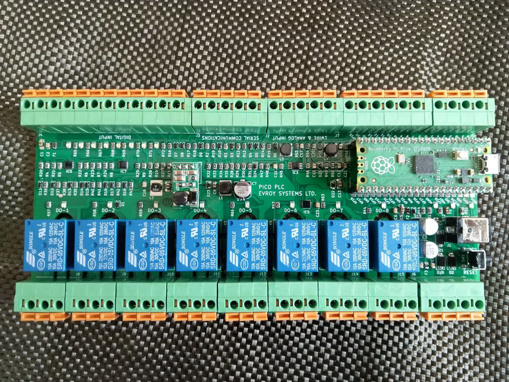

# The RP2040/RP2350 PLC - picoPLC

This repo is the design files and sample code for the diy PLC "picoPLC". It is robust PLC using the Raspberry Pi microcontroller boards as the main controller. Supported boards:

- Raspberry Pico (RP2040)
- Raspberry Pico W (RP2040)
- Raspberry Pico 2 (RP2350 using ARM cores)
- Raspberry Pico 2 (RP2350 using RISC-V cores)

Other RP2040/RP2350 boards that follow the Raspberry Pico pinout are also supported

The picoPLC has the following features 

- 5-12V power (connections are 12V tolerant. NO 24V)
- Has a 3.3, 5V and 12V breakout (if 12V power used)
- 8 digital outputs using relays
- 8 digital inputs
- 3 analog inputs
- 2 analog outputs (PWM or analog)
- 1 1-wire (Dallas/DHT22/DHT11, etc)
- 1 I2C, SPI, UART (shared pins)

The picoPLC was originally designed to use the [OpenPLC](https://autonomylogic.com/) soft PLC but it has been tested with C/C++, MicroPython and CircuitPython. Sample code for the CircuitPython has been included. The demo CircuitPython code uses [pyRTOS](https://github.com/Rybec/pyRTOS) as a proof of concept for some asynchronous tasks. 

### Mutli-core operation

Multi-core operation is not supported in CircuitPython but is available using MicroPython. Multi-core operation can be achieved in OpenPLC by editing the HAL source files and using the Mbed OS toolchain. More details on Using OpenPLC can be found in [OpenPLC Notes](OpenPLC_notes.md)

### TODO
- :white_check_mark: Fix PWM range and frequency (rev2)
- :white_large_square: Revision 3 to support 24V inputs
- :white_large_square: Revision 3 to include opto-isolaters on the inputs
- :white_large_square: Additional sample code

## Schematic
Schematic was created in KiCad. The BoM can be found in **Schematic and PCB** folder. The image below is only of page 1. Full schematic can be found in the folder.

### Physical device

**Revison 1**

**Revison 2**

