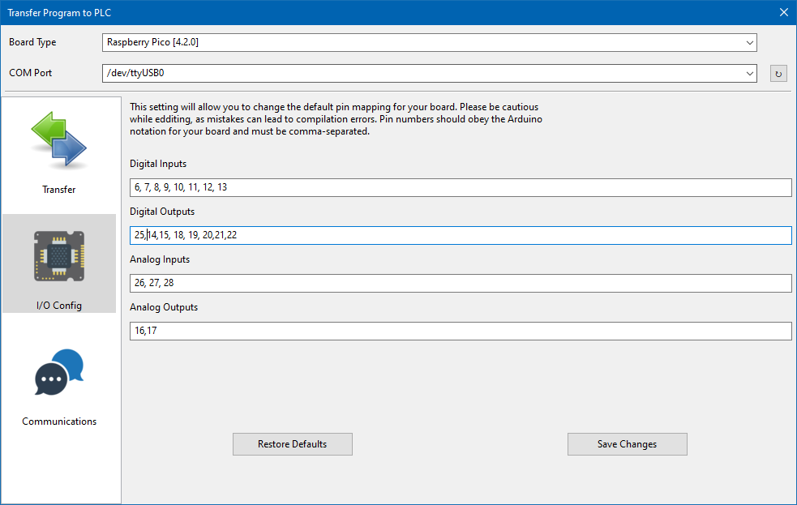
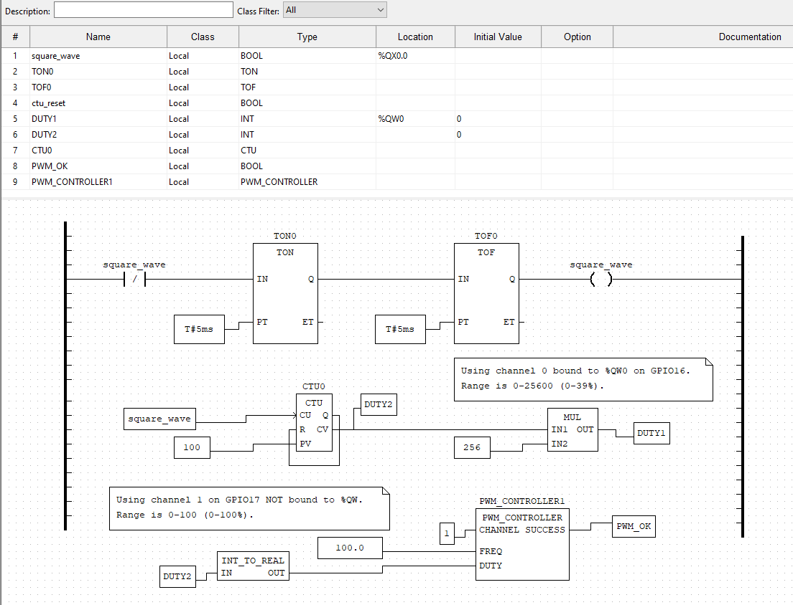
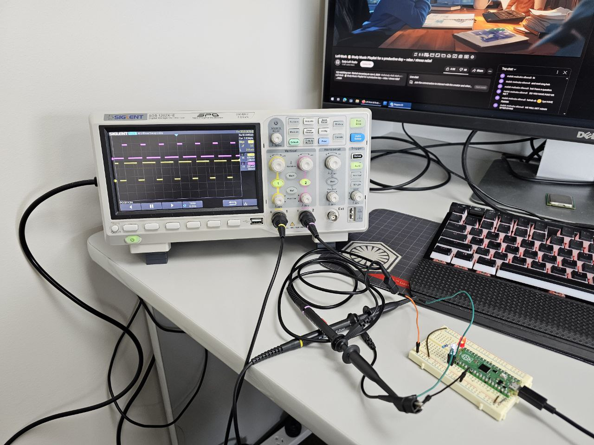

# Analog out as PWM tests on the RP2040 for OpenPLC #

- In OpenPLC the pico analog_out accepts values from 0-65535 for a full PWM range which is then converted internally to 0-100.
- The PWM_CONTROLLER uses values 0-100 for the full PWM.

The OpenPLC driver code uses the Arduino library [RP2040_PWM](https://github.com/khoih-prog/RP2040_PWM).

## The PWM test
This folder contains an OpenPlC test project (picotest) to test the PWM analog out. The [rp2040pico.cpp](rp2040pico.cpp) is the driver file that has been updatde and should be in the current OpenPLC build as of 15 Nov 2024.

Testing was conducted on a Raspberry Pico 1 (RP2040)

You can use the analog out as a normal pin running PWM at a default of 10KHz (frequency set in the above code).

You can also use the PWM_CONTROLLER block to alter the PWM frequency other than the default 10KHz.

During the testing the pico IO was configured as follows

Two LEDS were attached to GPIO16 (as %QW0) & GPIO17 (channel 1 on the PWM_CONTROLLER) with GPIO25 for the onboard LED.

The testing

Video of the two waveforms

-end-of-file-